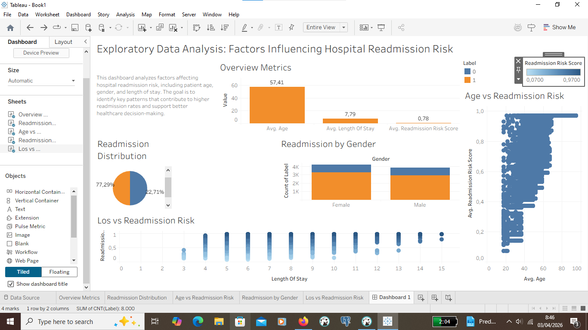

Hospital Readmission Analysi
This project explores factors influencing hospital readmission risk using Tableau. The analysis focuses on identifying key patterns related to patient demographics and hospital stay characteristics.
The goal of this project is to understand what factors contribute to higher readmission rates and provide insights that can support better healthcare decision-making.
📊 Dashboard Preview

🔍 Key Insights

- The majority of patients (77%) were not readmitted, while 23% experienced readmission.
- Age shows a positive trend with readmission risk, indicating older patients are more likely to be readmitted.
- Length of stay is strongly associated with higher readmission risk.
- There is no significant difference in readmission rates between male and female patients.
- Overall, patient age and hospital stay duration are key drivers of readmission risk.

🎯 Conclusion

This analysis shows that patient age and length of stay are the main factors influencing hospital readmission risk. These insights can help healthcare providers identify high-risk patients and reduce readmission rates.
